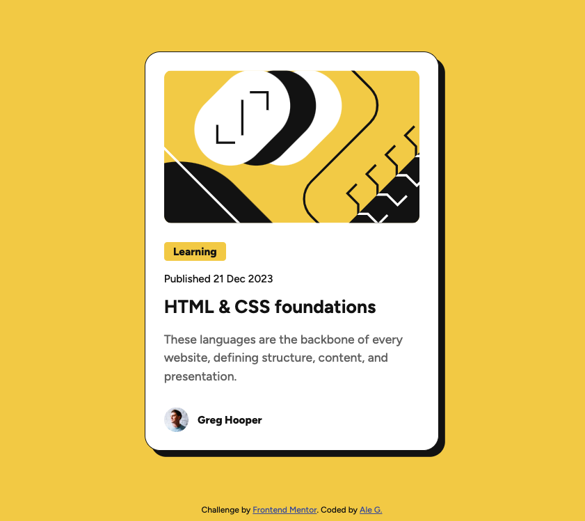

# Frontend Mentor - Blog preview card solution

This is a solution to the [Blog preview card challenge on Frontend Mentor](https://www.frontendmentor.io/challenges/blog-preview-card-ckPaj01IcS).

## Overview

### The challenge

Users should be able to:

- See hover and focus states for all interactive elements on the page

### Screenshot

### Links

- [Solution URL](https://www.frontendmentor.io/solutions/responsive-design-using-css-flexbox-and-syntactic-html-DNn5dNT-8B)
- [Live Site URL](https://blog-preview-card-six-psi.vercel.app/)

## My process

### Built with

- Semantic HTML5 markup
- CSS custom properties
- Flexbox
- Mobile-first workflow

### What I learned

I learn how to better managed spacing between elements and creating responsive designs for different screen sizes.

### Continued development

I feel like I still need to work with more complex layouts, improve on responsive designs and implement other tools like grid and animations.

## Author

- Website - [Ale Gutierrez](https://alemolina43.github.io/)
- Frontend Mentor - [@alemolina43](https://www.frontendmentor.io/profile/alemolina43)
- Github - [@alemolina43](https://github.com/alemolina43)
